## About Me

I'm **Gandlaparthi Yaswanthi**, an **AI/ML Engineer • Software Developer** with a strong interest in AI, Machine
Learning, and building software that solves real-world problems. I enjoy
working across the stack — from training models to shipping full
production apps — and I'm always picking up new tools and techniques
along the way. Currently open to **AI/ML** and **Software Engineering**
opportunities.

- 🔭 Currently focused on: **Building production-grade AI systems & full-stack apps**
- 🌱 Currently learning: **LLM Agents · System Design · Cloud (AWS/GCP) · MLOps**
- 📍 Based in **India**
- 💬 Ask me about: Deep Learning, NLP, Full-Stack Development

<table>
<tr>
<td width="50%"></td>
<td width="50%"></td>
</tr>
</table>

## Contribution Activity

## GitHub Stats

  
  

  

  

## Tech Stack

**Programming Languages**

   

**AI / Machine Learning**

      

**Frameworks**

      

**Databases**

  

**Developer Tools**

      

## Achievements

- 🏆 CGPA 9.10 / 10.0 in B.Tech CSE (AI & ML)
- 🏆 Built 6+ production-style AI/full-stack projects
- 🏆 Active open-source contributor

## Currently Learning

`LLM Agents` · `System Design` · `Cloud (AWS/GCP)` · `MLOps`

## Connect With Me

  
  
  

Built with Python • SVG + SMIL • Updated automatically using GitHub Actions

  

